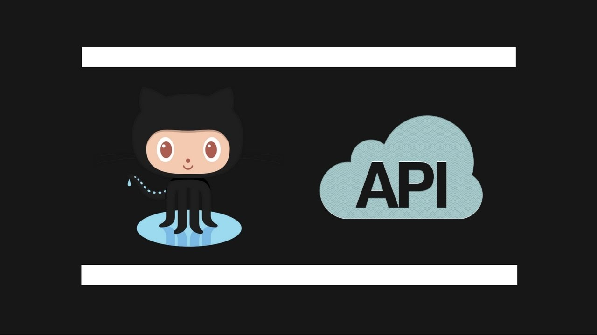

<!DOCTYPE html>
<html lang="en">

<head>
    <meta charset="UTF-8">
    <meta name="viewport" content="width=device-width, initial-scale=1.0">
    <title>Gitify - GitHub Stats API</title>
    
</head>

<body>

    <!-- Header Section -->
    <header>
        <h1>Gitify</h1>
        
A GitHub Stats API for comprehensive statistics and insights

          <button class="button" onclick="window.location.href='http://web-02.shakir.tech/gitify';">Visit Deployed Project</button>

    </header>

    <!-- Feature Section -->
    <section id="section1">
        <!-- Feature 1 -->
        

            <!-- Centered Image -->
            
            
Gitify allows users to search for other github users stats, trending repos, popular langguages and also allows users to search for a specific language in onces repo.

        

        

        

        

        

    </section>

    <!-- About Section -->
    <section id="section2">
        <h1 style="font-weight: bold;">Description</h1>
        

            Gitify is a GitHub Stats API that allows users to retrieve comprehensive statistics and insights for any GitHub user.
            This API provides a user-friendly interface to access a wide range of data related to GitHub users, repositories, commits, followers, and more.
        

                                                                                   142,5         62%
   <h3>Project Timeline</h3>
        
Include project timeline information here.

        <!-- You can include the fact that it's a Portfolio Project for Holberton School with a link -->

<!-- Add links for other team members -->

 <!-- Project Inspiration -->
    

        <h3>Inspiration</h3>
        

            Gitify was inspired by the need for a user-friendly GitHub Stats API to simplify the process of collecting and presenting GitHub user statistics.
            The idea stemmed from personal experiences in tracking GitHub activity and wanting to provide a valuable resource for developers and organizations.
        

    

    <!-- Project Timeline -->
    

        <h3>Project Timeline</h3>
        

            The development of Gitify started in [Month Year] and went through several iterations to refine its features and user interface.
            It has been an ongoing journey of exploration and learning, driven by the passion for creating a useful tool for the GitHub community.
        

    

    <!-- Portfolio Project for Holberton School -->
    

        <h3>Portfolio Project for Holberton School</h3>
        

            Gitify is a Portfolio Project for Holberton School, showcasing the skills and knowledge gained during the course.
            You can explore more Holberton School projects on the <a href="link-to-holberton-portfolio" target="_blank">Holberton School Portfolio</a>.
        

    

    <!-- Team Members -->
    

        <h3>Team Members</h3>
        <ul>

        </ul>
    

       <!-- GitHub Repository Section -->
<h3>GitHub Repository</h3>
  
<a href="link-to-github-repo" target="_blank">GitHub Repository</a>

</section>

<!-- Footer Section -->
<footer>
    
&copy; 2023 Gitify - GitHub Stats API

</footer>
           <!-- Authors Section -->
 
 
 
<!-- Add links for other team members -->

</body>

</html>
                                                                                   205,5         Bot

                                                                            181,5         88%

